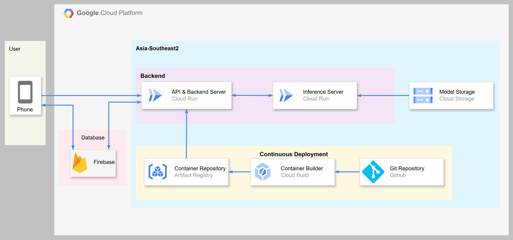

# CrowdWise Bali (API & Backend)

This is our backend service for our mobile app "CrowdWise Bali".

## Architecture & Deployment

We relied on Google Cloud Platform services for deployment. Below is the illustration of the underlying architecture.

This repository hosts the **API & Backend** service code. The **inference** service code is hosted [here](https://github.com/Bangkit-Bersama/CrowdWiseBali-inference).

CI/CD is achieved with Cloud Build connected to this repository. Two branches are used:

- `staging`: Staging deployment
- `prod`: Prod deployment

Builds are triggered after each commit to those branches. We do not commit to those branches directly, instead we merge to those branches from `master`.

## API Documentation

Coming soon!
